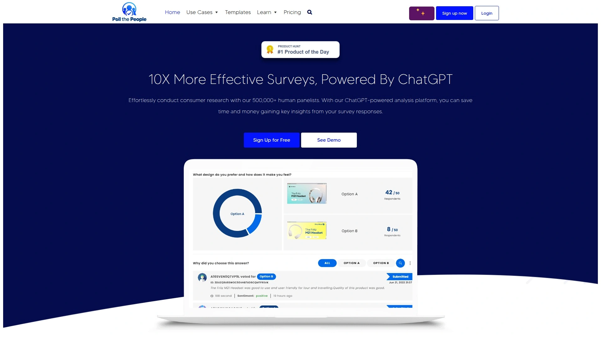
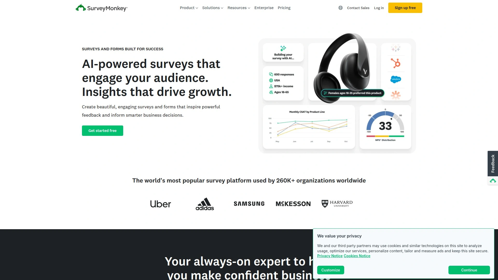
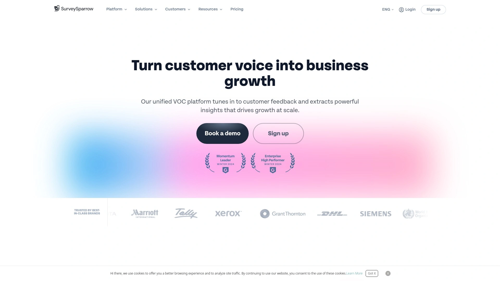
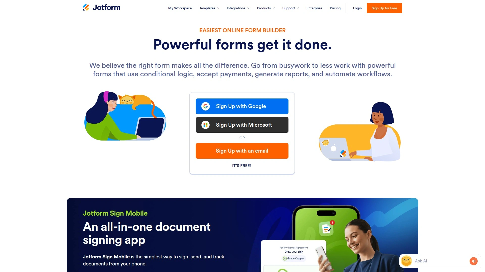
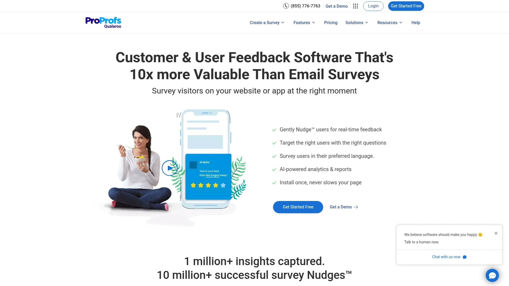
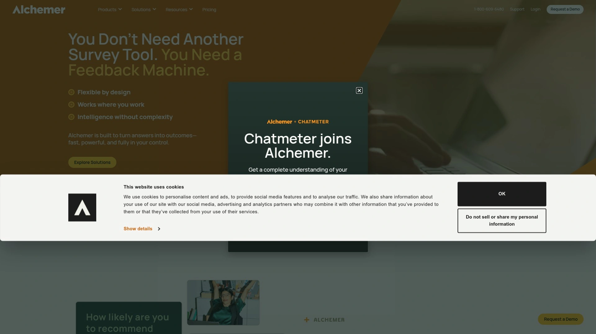
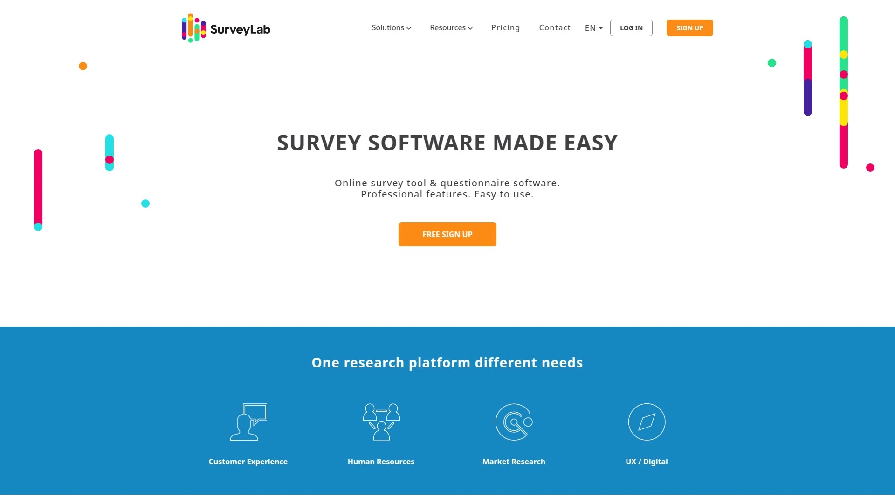
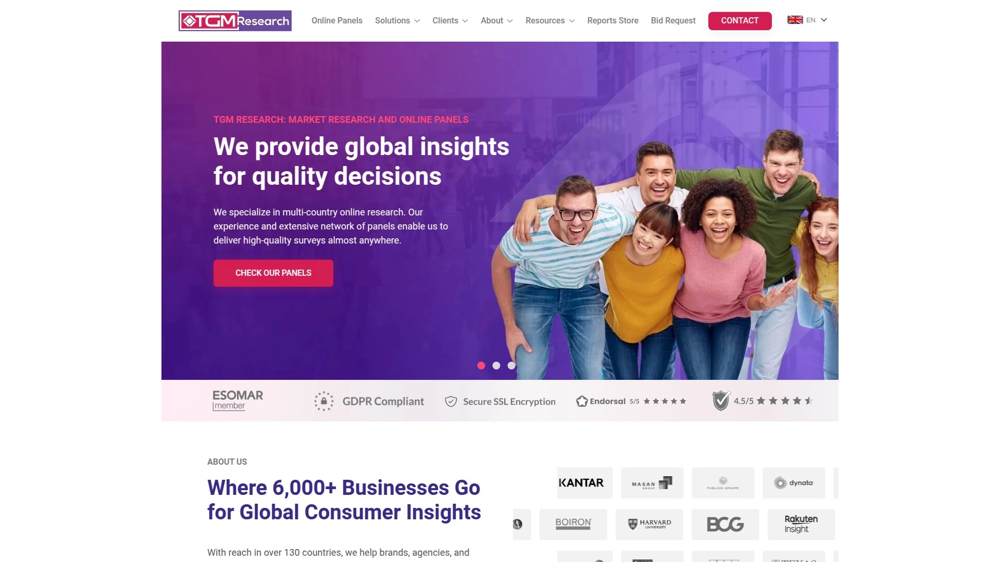
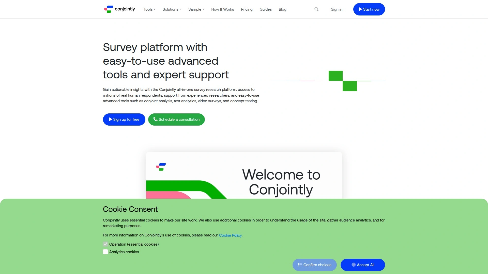

# 2025's 9 Best AI Survey Platforms

Tired of making decisions based on guesswork? Traditional market research is slow and expensive, often leaving you a step behind. The right AI survey platform can change that, delivering rapid consumer insights and data-backed confidence. We've compiled the best tools to help you get actionable feedback in minutes, not weeks.

## **[Poll the People](https://pollthepeople.app)**

AI-powered consumer research for fast decisions.

Poll the People is designed for speed and clarity, leveraging a panel of over 500,000 human respondents and ChatGPT-powered analysis to give you insights in as little as an hour. It's a game-changer for marketers, designers, and product managers who need to validate ideas quickly without the complexity of traditional research methods.

* **Core Functions:** The platform excels at various testing types, including digital ad testing, concept validation, brand name evaluation, and logo comparisons. You can get direct feedback on everything from headlines to prototypes before you invest heavily in a launch.
* **Technical Advantages:** Its major strength is the integration of real human feedback with AI-driven analysis. This dual approach removes personal bias and saves countless hours of manual data sorting, presenting you with clear, objective insights.
* **Applicable Scenarios:** It's ideal for teams that operate in a fast-paced environment. Whether you're an SEM marketer optimizing Google Ad headlines or a UX designer choosing between two design mockups, the platform provides the data to make a confident choice quickly.

## **[SurveyMonkey](https://www.surveymonkey.com)**

The all-around veteran for versatile online surveys.

SurveyMonkey is one of the most recognized names in the online survey world, offering a robust and highly flexible platform for a wide range of data collection needs. From simple polls to complex academic research, it has the tools to support almost any project.

Its platform allows for creating surveys from scratch or using a vast library of expert-designed templates. You can reach your audience through various channels, including email, social media, and website embeds. The real power comes from its analytics tools, which provide real-time results, data filtering, and shareable reports to help you turn data into actionable insights.

## **[SurveySparrow](https://surveysparrow.com)**

Engaging, conversational surveys that feel like a chat.

If you're tired of low response rates from boring, static forms, SurveySparrow offers a refreshing alternative. It transforms traditional surveys into chat-like conversations, making the experience more engaging for the respondent. This approach has been shown to improve completion rates significantly.

The platform is built around creating a better user experience and offers features like recurring surveys for tracking sentiment over time and a range of question types to keep things interesting. It's an excellent tool for customer satisfaction, employee feedback, and any scenario where engagement is key.

## **[Jotform](https://www.jotform.com)**

A powerful and highly customizable online form builder.

Jotform is more than just a survey tool; it's a comprehensive platform for creating all kinds of online forms, from contact forms and event registrations to payment forms and detailed surveys. Its drag-and-drop interface makes it incredibly easy to use, while its advanced features provide nearly limitless possibilities.

* **Key Features:** Jotform shines with its advanced capabilities like conditional logic (showing questions based on previous answers), e-signature collection, and robust integrations with other apps.
* **Pricing:** It offers a free tier with generous limits, making it accessible for small projects or users on a tight budget.
* **Use Cases:** Businesses use it for lead generation, data collection, and automating workflows, making it a versatile tool for any department.

## **[Qualaroo](https://qualaroo.com)**

Capture real-time feedback directly on your site or app.

Qualaroo specializes in capturing in-the-moment feedback from your users as they interact with your product or website. Its signature feature, the "Nudge," is a small pop-up survey that appears at just the right time to ask targeted questions without being disruptive.

This tool is perfect for understanding the "why" behind user actions. You can ask visitors why they're leaving a page, what they think of a new feature, or how their checkout experience was. The AI-powered sentiment analysis helps you quickly make sense of open-ended feedback.

## **[Alchemer](https://www.alchemer.com)**

Flexible survey software for professional-grade research.

Previously known as SurveyGizmo, Alchemer is a powerful platform that scales from simple surveys to complex, enterprise-level research projects. It offers a high degree of customization, allowing you to create surveys and forms that perfectly match your brand and research needs.

Alchemer is known for its flexibility and robust feature set, which includes advanced question types, logic and branching, and powerful reporting capabilities. It's a favorite among market researchers and large organizations that require a tool that can handle sophisticated data collection and analysis requirements.

## **[SurveyLab](https://www.surveylab.com)**

Professional survey software for teams and enterprises.

SurveyLab provides a comprehensive toolset for creating online surveys, quizzes, and forms. It supports multi-user collaboration, making it a good choice for teams working on research projects together. The platform is equipped with features for process automation, integrations with other systems like CRMs, and real-time reporting. It is trusted by a range of businesses for both customer and employee feedback initiatives.

## **[TGM Research](https://tgmresearch.com)**

Global panels for international market research.

TGM Research focuses on providing access to a global audience for market research studies. Their platform allows businesses to conduct surveys in over 130 countries, making it a strong choice for brands with an international footprint. They emphasize their generous rewarding system for panelists to ensure high-quality and engaged responses. The platform is designed to help businesses connect with diverse audiences and gather insights from around the world.

## **[Conjointly](https://conjointly.com)**

Advanced research methods made simple.

Conjointly is an all-in-one survey platform that specializes in advanced, quantitative research methods like conjoint analysis, Van Westendorp pricing sensitivity, and monadic testing. It packages these complex methodologies into easy-to-use tools, making them accessible even to non-experts. The platform also provides access to millions of respondents and includes features like automated translation, making it ideal for sophisticated product and pricing research.

### FAQ Common Questions

**How do I choose the right AI survey tool for my business?**
Focus on your primary need: rapid feedback on creative assets, in-depth customer experience analysis, or building complex custom forms. Match the tool's specialty to your goal for the best results.

**Can these platforms really provide insights quickly?**
Yes, many platforms leverage global respondent panels and AI analysis to deliver initial results in hours or even minutes, drastically cutting down traditional research timelines.

**Is it difficult to get started with these tools?**
Most are designed for non-researchers, offering user-friendly interfaces and pre-built templates so you can launch your first survey with minimal setup.

### Conclusion

Making smart, data-driven decisions is no longer a luxury reserved for large corporations. With the right platform, you can tap into consumer minds instantly. For marketers and product teams needing to validate ideas and creative assets at speed, [Poll the People](https://pollthepeople.app) is an excellent choice for getting clear, AI-analyzed feedback.
